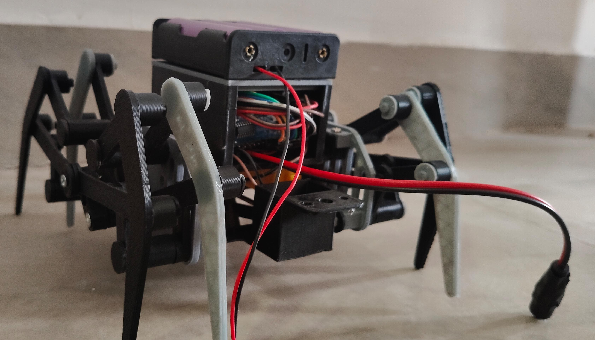
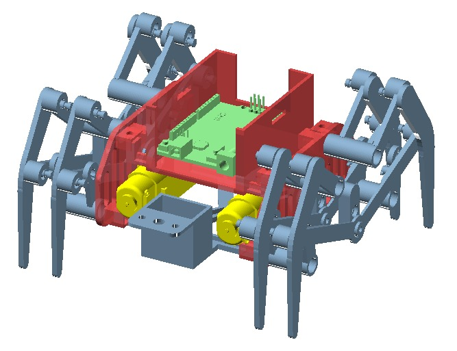
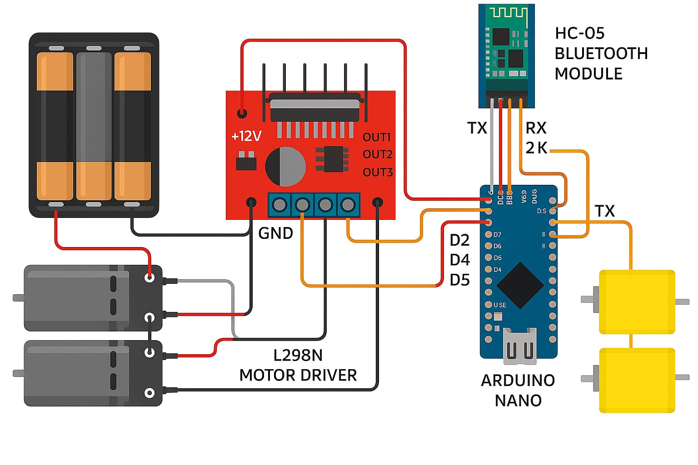

# Four-Legged-Bluetooth--Controlled-Spider-Robot

A simple and efficient Arduino Nano–based spider robot that uses only 2 BO motors to control 8 legs through mechanical linkage. The robot receives directional commands wirelessly via an HC-05 Bluetooth module and is powered by three 18650 batteries. Designed for educational, experimental, or entertainment purposes, the robot offers a low-cost, customizable platform.

## 📸 Product Image

## 🧩 3D View 

## 🎥 Working Demo Video

# 📝 Description

This project presents a Bluetooth-controlled spider robot powered by an Arduino Nano. The robot features eight legs, but impressively operates using only two BO motors, thanks to a mechanical linkage system. Commands are sent via a Bluetooth terminal app, allowing the robot to move forward, backward, left, right, or stop. It is powered by a 3-cell 18650 battery pack, and designed to be simple, cost-effective, and flexible — making it suitable for educational, experimental, and personal robotics applications.

The project also lays a solid foundation for future upgrades such as obstacle detection, automation, and mobile app control.

# ✨ Features

✅ Bluetooth-Controlled: Uses an HC-05 module for wireless communication with any Android phone.

🦿 Efficient Leg Movement: Only 2 motors drive all 8 legs via mechanical linkage.

⚡ Battery-Powered: Runs on three 18650 lithium batteries.

🛠️ Simple Construction: Uses readily available components with minimal wiring.

📱 Command-based Movement: Receives F, B, L, R, S for forward, backward, left, right, and stop actions.

🔧 Expandable: Designed for future development (sensor integration, mobile app, automation, etc.).

🧩 Multipurpose Use: Can be used as a toy, learning tool, personal assistant, or experimental prototype.

# 🔧 Components Used

**Arduino Nano**:Acts as the brain of the robot, controlling all motor movements based on Bluetooth commands.

**HC-05 Bluetooth Module**: Enables wireless communication between the robot and a smartphone using a Bluetooth terminal app.

**L298N Motor Driver Module**: Drives the two BO motors, controlling their speed and direction according to signals from the Arduino.

**BO Motors (60 RPM) – 2 Nos**: These two DC gear motors are used to control all eight legs of the spider robot through a mechanical linkage mechanism.

**18650 Lithium Batteries – 3 Nos**: Serve as the main power source for the entire system, providing enough current for the motors and Arduino.

**18650 Battery Holder**: Holds and connects the three batteries in series to deliver the required voltage.

**Jumper Wires and Connectors**: Used to connect all components properly within the circuit.

**Robot Frame or Chassis**: The structural base of the robot where all electronic and mechanical components are mounted.

## 🖼️ Circuit Diagram

# 🛠️ Setup Instructions

-> Connect all components as per the circuit diagram provided in the Images/ folder.

-> Upload the Arduino code from the Code/ folder to your Arduino Nano using the Arduino IDE.

-> Power the robot using 3 fully charged 18650 batteries in the holder.

-> Pair your phone with the HC-05 Bluetooth module (default password: 1234).

-> Open a Bluetooth terminal app on your phone (like Bluetooth Terminal HC-05) to begin controlling the robot.

# 📲 Usage (Bluetooth Commands)

After connecting your mobile device to the HC-05 via Bluetooth, send the following characters through the Bluetooth terminal app:

**Command	Action**

F 	Move Forward

B	  Move Backward

L 	Turn Left

R	  Turn Right

S	  Stop Movement

Each command triggers a specific motor configuration, enabling the robot to respond accordingly.

# 🧠 How It Works

The spider robot is controlled by an Arduino Nano, which receives single-character commands from a mobile device via the HC-05 Bluetooth module. Based on the command, the Arduino activates specific pins connected to the L298N motor driver, which in turn controls two BO motors.

Although the robot has 8 legs, it uses a mechanical linkage system that allows all legs to move in coordination using just 2 motors. This reduces complexity and cost while maintaining mobility. The system is powered by a 3-cell 18650 battery pack, and all components are mounted onto a custom-built chassis.

# 🚀 Applications + Future Scope

**🛠 Applications**

Educational robotics project

Toy or hobby robot

Personal assistant prototype

Lab or small industrial automation testbed

**🔮 Future Scope**

Add obstacle avoidance using ultrasonic sensors

Add voice control or gesture recognition via mobile

Integrate with IoT platforms for remote monitoring

Replace BO motors with servo motors for more advanced leg articulation

Design a custom Android app interface

# 👤 Author / Credits

Chandra Manaswitha

B.Tech – Artificial Intelligence and Machine Learning

GitHub: @manaswitha12

Project Year: 2025

**From**: 

SIMATS Engineering, Saveetha Institute of Medical and Technical Sciences

Chennai,Tamilnadu,India
